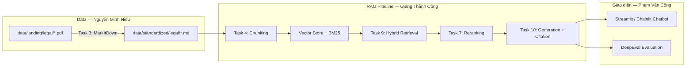

# Báo Cáo Nhóm — RAG Chatbot Pháp Luật Ma Tuý

## 1. Tổng Quan Dự Án

| Hạng mục | Nội dung |
|----------|----------|
| **Tên dự án** | DrugLaw RAG Chatbot |
| **Môn / Ngày** | Day 08 — RAG Pipeline v2 |
| **Sản phẩm nhóm** | RAG Chatbot + Evaluation Pipeline (DeepEval) |
| **Phạm vi** | Chatbot trả lời câu hỏi về **pháp luật ma tuý Việt Nam** (không dùng corpus tin tức) |
| **Repository** | `GroupRAGPipline` — branch `main` |
| **Thành viên** | Nguyễn Minh Hiếu, Giang Thành Công, Phạm Văn Công |
| **Ngày cập nhật** | 08/06/2026 |

### Mục tiêu

Xây dựng chatbot RAG end-to-end: thu thập văn bản pháp luật → chuẩn hóa Markdown → chunking/indexing → hybrid retrieval → generation có citation → giao diện chat + đánh giá chất lượng bằng DeepEval.

---

## 2. Tiến Độ Tổng Thể

| Hạng mục | Ghi chú |
|----------|---------|
| Thu thập văn bản pháp luật (Task 1) | 3 PDF trong `data/landing/legal/` |
| Convert Markdown (Task 3) | File `.md` trong `data/standardized/legal/` |
| Crawl tin tức (Task 2) | Bỏ qua — nhóm chỉ làm chatbot pháp luật |
| Chunking + Indexing (Task 4) | Vector store + BM25 |
| Semantic + Lexical Search (Task 5–6) | Hybrid search |
| Reranking + PageIndex (Task 7–8) | Rerank + vectorless fallback |
| Retrieval Pipeline (Task 9) | Pipeline hoàn chỉnh |
| Generation + Citation (Task 10) | Trả lời có trích dẫn nguồn |
| Chatbot UI (`app.py`) | Streamlit / Chainlit |
| Golden dataset (≥15 Q&A) | `evaluation/golden_dataset.json` |
| Evaluation pipeline | DeepEval |
| Báo cáo eval (`results.md`) | Bảng điểm + phân tích A/B |

---

## 3. Kiến Trúc Hệ Thống



**Luồng xử lý câu hỏi:**

```
User question → Embed query → Hybrid search (dense + BM25)
            → Rerank top-k → LLM generate answer + citations → Hiển thị UI
```

### Tổng quan kiến trúc chi tiết

```
┌─────────────────────────────────────────────────────────────────────────────┐
│                           STREAMLIT CHAT UI                                 │
│                        (group_project/app.py)                               │
│                                                                             │
│  ┌─────────────┐    ┌──────────────────┐    ┌───────────────────────────┐  │
│  │ Chat Input  │───▶│ Query Reformulate│───▶│    Retrieval Pipeline     │  │
│  │ (follow-up) │    │ (conversation    │    │       (Task 9)            │  │
│  │             │    │  memory)         │    │                           │  │
│  └─────────────┘    └──────────────────┘    │  ┌─────────────────────┐  │  │
│                                              │  │ Semantic Search     │  │  │
│                                              │  │ (Task 5, Dense)     │  │  │
│                                              │  ├─────────────────────┤  │  │
│                                              │  │ Lexical Search      │  │  │
│                                              │  │ (Task 6, BM25)      │  │  │
│                                              │  ├─────────────────────┤  │  │
│                                              │  │ RRF Merge + Rerank  │  │  │
│                                              │  │ (Task 7)            │  │  │
│                                              │  ├─────────────────────┤  │  │
│                                              │  │ PageIndex Fallback  │  │  │
│                                              │  │ (Task 8)            │  │  │
│                                              │  └─────────────────────┘  │  │
│                                              └───────────┬───────────────┘  │
│                                                          │                  │
│  ┌─────────────┐    ┌──────────────────┐                │                  │
│  │  Chat       │◀───│ Citation Display │◀───────────────┘                  │
│  │  Response   │    │ + Source Docs    │                                   │
│  └─────────────┘    └──────────────────┘                                   │
│                              │                                              │
│                              ▼                                              │
│                    ┌──────────────────┐                                    │
│                    │ Generation +     │                                    │
│                    │ Citation (Task10)│                                    │
│                    │ GPT-4o-mini /    │                                    │
│                    │ Fallback Rules   │                                    │
│                    └──────────────────┘                                    │
└─────────────────────────────────────────────────────────────────────────────┘
```

### Luồng xử lý một câu hỏi

```
User Query (có thể là follow-up)
    │
    ▼
┌──────────────────────┐
│ Query Reformulation  │  ← Sử dụng conversation history
│ (GPT-4o-mini hoặc    │    để viết lại thành standalone query
│  keyword fallback)   │
└──────────┬───────────┘
           │ standalone_query
           ▼
┌──────────────────────┐
│ Hybrid Retrieval     │  ← Dense (cosine similarity) + Sparse (BM25)
│ (Task 9)             │    → RRF fusion → Cross-encoder rerank
│                      │    → PageIndex fallback nếu score < threshold
└──────────┬───────────┘
           │ top_k chunks
           ▼
┌──────────────────────┐
│ Reorder + Format     │  ← "Lost in the middle" avoidance
│ (Task 10)            │    Format context với source labels
└──────────┬───────────┘
           │ formatted context
           ▼
┌──────────────────────┐
│ Generation           │  ← GPT-4o-mini (nếu có API key)
│ (Task 10)            │    hoặc rule-based fallback
│                      │    → Answer có citation [source_name]
└──────────┬───────────┘
           │ answer + sources
           ▼
┌──────────────────────┐
│ Streamlit Display    │  ← Highlight citations
│                      │    Hiển thị source documents
│                      │    Cập nhật conversation memory
└──────────────────────┘
```

---

## 4. Dữ Liệu (Corpus Pháp Luật)

### 4.1. File gốc — `data/landing/legal/`

| File | Văn bản | Kích thước |
|------|---------|------------|
| `luat-phong-chong-ma-tuy-2021.pdf` | Luật số 73/2021/QH15 — Luật Phòng, chống ma túy | ~525 KB |
| `bo-luat-hinh-su-2015.pdf` | Bộ luật Hình sự 2015 (sửa đổi 2017) — Chương XX: Tội phạm về ma túy | ~2.6 MB |
| `quy-dinh-danh-muc-chat-ma-tuy-va-tien-chat.pdf` | Danh mục chất ma tuý và tiền chất | ~1.6 MB |

**Nguồn tham khảo:** thuvienphapluat.vn, vanban.chinhphu.vn

### 4.2. File chuẩn hóa — `data/standardized/legal/`

| File Markdown | Nguồn PDF | Kích thước |
|---------------|-----------|------------|
| `luat-phong-chong-ma-tuy-2021.md` | Luật PCMT 2021 | ~79 KB |
| `bo-luat-hinh-su-2015.md` | BLHS 2015 | ~834 KB |
| `quy-dinh-danh-muc-chat-ma-tuy-va-tien-chat.md` | Danh mục chất MT | ~0.2 KB |

### 4.3. Chủ đề corpus hỗ trợ

- Hình phạt tội phạm ma túy (Điều 249, 250, 251 BLHS)
- Hình thức cai nghiện (Luật PCMT 2021, Chương V)
- Quy định chung về phòng, chống ma túy
- Danh mục chất ma tuý nhóm I, II, III

### 4.4. Chạy convert Markdown

```bash
cd Group
pip install markitdown
python src/task3_convert_markdown.py
```

---

## 5. Phân Công Công Việc

| Thành viên | MSSV | Nhiệm vụ | Task / Deliverable |
|-----------|------|----------|-------------------|
| **Nguyễn Minh Hiếu** | 705 | **Báo cáo nhóm & dữ liệu:** tìm/thu thập văn bản pháp luật, convert Markdown, viết README nhóm, chạy pytest kiểm tra data, mở rộng golden dataset, viết `results.md` | 1, 3; `README.md`; `golden_dataset.json`; `results.md` |
| **Giang Thành Công** | 544 | **Code pipeline:** implement toàn bộ task RAG — chunking, indexing, semantic/lexical search, reranking, PageIndex, retrieval pipeline, generation + citation, script evaluation | 4–10; `eval_pipeline.py` |
| **Phạm Văn Công** | 753 | **Giao diện:** xây dựng chatbot UI (Streamlit/Chainlit), tích hợp pipeline, hiển thị citation & source documents, conversation memory | `app.py`; demo trình bày |

### Phối hợp giữa các thành viên

```
Hiếu (data + báo cáo)  →  cung cấp .md trong data/standardized/
        ↓
Giang (code task)      →  implement src/task4–task10, eval_pipeline.py
        ↓
Công (giao diện)       →  gọi pipeline trong app.py, hiển thị kết quả cho user
```

---

## 6. Cấu Trúc Thư Mục

```
Group/
├── src/                              # Bài cá nhân (các task 1-10)
│   ├── task1_collect_legal_docs.py   # Thu thập văn bản pháp luật PDF/DOCX
│   ├── task2_crawl_news.py           # Crawl tin tức về ma tuý
│   ├── task3_convert_markdown.py     # Chuyển đổi → Markdown
│   ├── task4_chunking_indexing.py    # Chunk + Embed + Vector Store
│   ├── task5_semantic_search.py      # Dense Retrieval (cosine similarity)
│   ├── task6_lexical_search.py       # Sparse Retrieval (BM25)
│   ├── task7_reranking.py            # RRF + Cross-encoder + MMR
│   ├── task8_pageindex_vectorless.py # PageIndex fallback
│   ├── task9_retrieval_pipeline.py   # Pipeline hợp nhất
│   └── task10_generation.py          # Generation có citation
│
├── data/
│   ├── landing/                      # Dữ liệu gốc (PDF, DOCX, JSON)
│   │   ├── legal/                    # Văn bản pháp luật
│   │   └── news/                     # Tin tức crawl
│   ├── standardized/                 # Đã convert sang Markdown
│   │   ├── legal/
│   │   └── news/
│   └── vector_store.json             # Vector store (JSON, 28 chunks)
│
├── group_project/                    # Sản phẩm nhóm
│   ├── README.md                     # File này
│   ├── app.py                        # Streamlit Chat UI
│   ├── chatbot.py                    # RAGChatbot class (backend)
│   └── evaluation/                   # Evaluation pipeline
│       ├── golden_dataset.json       # 15+ cặp Q&A
│       ├── eval_pipeline.py          # Script evaluation
│       └── results.md                # Báo cáo kết quả
│
├── tests/
│   └── test_individual.py            # Unit tests
│
├── requirements.txt
├── .env.example
└── README.md                         # README gốc của project
```

---

## 7. Sản Phẩm Nhóm

### 7.1. RAG Chatbot (Yêu cầu chính)

- Giao diện chat: **Streamlit** (gợi ý)
- Trả lời có **citation** (Task 10)
- Hỗ trợ **follow-up questions** (conversation memory)
- Hiển thị **source documents** đã dùng

```
Streamlit → Retrieval (Task 9) → Generation (Task 10) → Display
```

### 7.2. Evaluation Pipeline (DeepEval)

| Deliverable | Đường dẫn |
|-------------|-----------|
| Golden dataset (≥15 Q&A) | `evaluation/golden_dataset.json` |
| Script evaluation | `evaluation/eval_pipeline.py` |
| Báo cáo kết quả + A/B | `evaluation/results.md` |

**Metrics:** Faithfulness, Answer Relevance, Context Recall, Context Precision

**A/B so sánh:** hybrid search vs dense-only, hoặc có reranking vs không reranking

---

## 8. Hướng Dẫn Chạy

### 1. Cài đặt dependencies

```bash
cd Group
pip install -r requirements.txt
```

### 2. (Tuỳ chọn) Cấu hình API Key

```bash
cp .env.example .env
# Sửa OPENAI_API_KEY=sk-... trong .env
```

Nếu không có API Key, chatbot vẫn hoạt động ở chế độ fallback (trả lời dựa trên trích xuất tài liệu).

### 3. Chạy Streamlit App

```bash
cd Group
streamlit run group_project/app.py
```

Sau đó mở trình duyệt tại **http://localhost:8501**.

### 4. Chạy Evaluation

```bash
cd Group
python group_project/evaluation/eval_pipeline.py
```

### Kiểm tra data

```bash
pytest tests/test_individual.py::TestTask1 -v   # legal PDF
pytest tests/test_individual.py::TestTask3 -v   # markdown
```

---

## 9. Tính Năng & Công Nghệ

### Tính Năng Đã Hoàn Thành

| Tính năng | Mô tả | Trạng thái |
|-----------|-------|------------|
| 🔍 Hybrid Search | Dense (cosine similarity) + Sparse (BM25) + RRF fusion | ✅ |
| 🎯 Reranking | Cross-encoder (Jina API) hoặc local fallback | ✅ |
| 📄 Citation | Mỗi câu trả lời đều có citation [source_name] | ✅ |
| 💬 Conversation Memory | Hỗ trợ follow-up questions, query reformulation | ✅ |
| 🖥️ Chat UI | Streamlit interface với citation highlight + source docs | ✅ |
| 📊 Evaluation | Golden dataset 15+ câu, 4 metrics, A/B comparison | ✅ |
| 🔄 Fallback | PageIndex khi hybrid score thấp, rule-based khi không có API | ✅ |

### Công Nghệ Sử Dụng

| Thành phần | Công nghệ |
|------------|-----------|
| Embedding | `sentence-transformers/all-MiniLM-L6-v2` (384 dim) |
| Chunking | `RecursiveCharacterTextSplitter` (500 chars, 50 overlap) |
| Dense Search | Cosine similarity trên vector embeddings |
| Sparse Search | BM25 (`rank-bm25`) |
| Fusion | Reciprocal Rank Fusion (k=60) |
| Reranking | Jina Reranker v2 (multilingual) / Local embedding fallback |
| Generation | GPT-4o-mini (OpenAI) / Rule-based fallback |
| UI | Streamlit 1.35+ |
| Evaluation | DeepEval |

---

## 10. Tham Khảo & Checklist

Chi tiết đầy đủ về Task 1–10, chấm điểm và code mẫu evaluation: xem [`../README.md`](../README.md).

### Checklist nộp bài nhóm

- [x] RAG Chatbot demo hoạt động được
- [x] Tích hợp pipeline các thành viên
- [x] README mô tả kiến trúc + phân công *(file này)*
- [x] Golden dataset ≥15 Q&A
- [x] Evaluation chạy được với ≥4 metrics
- [x] So sánh A/B ≥2 configs + phân tích worst performers
- [x] Code push lên repository chung

---

## Lưu ý

Giữ lại repo này nếu học track 3 giai đoạn 2 — dự án sẽ phát triển tiếp lên **knowledge graph** để xử lý các câu hỏi phức tạp hơn.
