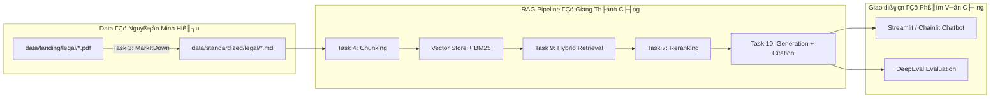

# Báo Cáo Nhóm — RAG Chatbot Pháp Luật Ma Tuý

## 1. Tổng Quan Dự Án

| Hạng mục | Nội dung |
|----------|----------|
| **Tên dự án** | DrugLaw RAG Chatbot |
| **Môn / Ngày** | Day 08 — RAG Pipeline v2 |
| **Sản phẩm nhóm** | RAG Chatbot + Evaluation Pipeline (DeepEval) |
| **Phạm vi** | Chatbot trả lời câu hỏi về **pháp luật ma tuý Việt Nam** (không dùng corpus tin tức) |
| **Repository** | `GroupRAGPipline` ΓÇö branch `personal/Hieu` |
| **Thành viên** | Nguyễn Minh Hiếu, Giang Thành Công, Phạm Văn Công |
| **Ngày cập nhật** | 08/06/2026 |

### Mục tiêu

Xây dựng chatbot RAG end-to-end: thu thập văn bản pháp luật → chuẩn hóa Markdown → chunking/indexing → hybrid retrieval → generation có citation → giao diện chat + đánh giá chất lượng bằng DeepEval.

---

## 2. Tiến Độ Tổng Thể

| Hạng mục | Ghi chú |
|----------|---------|
| Thu thập văn bản pháp luật (Task 1) | 3 PDF trong `data/landing/legal/` |
| Convert Markdown (Task 3) | File `.md` trong `data/standardized/legal/` |
| Crawl tin tức (Task 2) | Bỏ qua — nhóm chỉ làm chatbot pháp luật |
| Chunking + Indexing (Task 4) | Vector store + BM25 |
| Semantic + Lexical Search (Task 5ΓÇô6) | Hybrid search |
| Reranking + PageIndex (Task 7ΓÇô8) | Rerank + vectorless fallback |
| Retrieval Pipeline (Task 9) | Pipeline hoàn chỉnh |
| Generation + Citation (Task 10) | Trả lời có trích dẫn nguồn |
| Chatbot UI (`app.py`) | Streamlit / Chainlit |
| Golden dataset (≥15 Q&A) | `evaluation/golden_dataset.json` |
| Evaluation pipeline | DeepEval |
| Báo cáo eval (`results.md`) | Bảng điểm + phân tích A/B |

---

## 3. Kiến Trúc Hệ Thống



**Luồng xử lý câu hỏi:**

```
User question → Embed query → Hybrid search (dense + BM25)
            → Rerank top-k → LLM generate answer + citations → Hiển thị UI
```

---

## 4. Dữ Liệu (Corpus Pháp Luật)

### 4.1. File gốc — `data/landing/legal/`

| File | Văn bản | Kích thước |
|------|---------|------------|
| `luat-phong-chong-ma-tuy-2021.pdf` | Luật số 73/2021/QH15 — Luật Phòng, chống ma túy | ~525 KB |
| `bo-luat-hinh-su-2015.pdf` | Bộ luật Hình sự 2015 (sửa đổi 2017) — Chương XX: Tội phạm về ma túy | ~2.6 MB |
| `quy-dinh-danh-muc-chat-ma-tuy-va-tien-chat.pdf` | Danh mục chất ma tuý và tiền chất | ~1.6 MB |

**Nguồn tham khảo:** thuvienphapluat.vn, vanban.chinhphu.vn

### 4.2. File chuẩn hóa — `data/standardized/legal/`

| File Markdown | Nguồn PDF | Kích thước |
|---------------|-----------|------------|
| `luat-phong-chong-ma-tuy-2021.md` | Luật PCMT 2021 | ~79 KB |
| `bo-luat-hinh-su-2015.md` | BLHS 2015 | ~834 KB |
| `quy-dinh-danh-muc-chat-ma-tuy-va-tien-chat.md` | Danh mục chất MT | ~0.2 KB |

### 4.3. Chủ đề corpus hỗ trợ

- Hình phạt tội phạm ma túy (Điều 249, 250, 251 BLHS)
- Hình thức cai nghiện (Luật PCMT 2021, Chương V)
- Quy định chung về phòng, chống ma túy
- Danh mục chất ma tuý nhóm I, II, III

### 4.4. Chạy convert Markdown

```bash
cd Group
pip install markitdown
python src/task3_convert_markdown.py
```

---

## 5. Phân Công Công Việc

| Thành viên | MSSV | Nhiệm vụ | Task / Deliverable |
|-----------|------|----------|-------------------|
| **Nguyễn Minh Hiếu** | 705 | **Báo cáo nhóm & dữ liệu:** tìm/thu thập văn bản pháp luật, convert Markdown, viết README nhóm, chạy pytest kiểm tra data, mở rộng golden dataset, viết `results.md` | 1, 3; `README.md`; `golden_dataset.json`; `results.md` |
| **Giang Thành Công** | 544 | **Code pipeline:** implement toàn bộ task RAG — chunking, indexing, semantic/lexical search, reranking, PageIndex, retrieval pipeline, generation + citation, script evaluation | 4–10; `eval_pipeline.py` |
| **Phạm Văn Công** | 753 | **Giao diện:** xây dựng chatbot UI (Streamlit/Chainlit), tích hợp pipeline, hiển thị citation & source documents, conversation memory | `app.py`; demo trình bày |

### Phối hợp giữa các thành viên

```
Hiếu (data + báo cáo)  →  cung cấp .md trong data/standardized/
        Γåô
Giang (code task)      →  implement src/task4–task10, eval_pipeline.py
        Γåô
Công (giao diện)       →  gọi pipeline trong app.py, hiển thị kết quả cho user
```

---

## 6. Sản Phẩm Nhóm

### 6.1. RAG Chatbot (Yêu cầu chính)

- Giao diện chat: **Streamlit** (gợi ý)
- Trả lời có **citation** (Task 10)
- Hỗ trợ **follow-up questions** (conversation memory)
- Hiển thị **source documents** đã dùng

```
Streamlit → Retrieval (Task 9) → Generation (Task 10) → Display
```

### 6.2. Evaluation Pipeline (DeepEval)

| Deliverable | Đường dẫn |
|-------------|-----------|
| Golden dataset (≥15 Q&A) | `evaluation/golden_dataset.json` |
| Script evaluation | `evaluation/eval_pipeline.py` |
| Báo cáo kết quả + A/B | `evaluation/results.md` |

**Metrics:** Faithfulness, Answer Relevance, Context Recall, Context Precision

**A/B so sánh:** hybrid search vs dense-only, hoặc có reranking vs không reranking

---

## 7. Hướng Dẫn Chạy

```bash
# 1. Cài đặt
cd Group
pip install -r requirements.txt
cp .env.example .env   # điền OPENAI_API_KEY, WEAVIATE_URL, ...

# 2. Convert data
python src/task3_convert_markdown.py

# 3. Chạy chatbot
streamlit run app.py
# hoặc
chainlit run app.py

# 4. Chạy evaluation
python group_project/evaluation/eval_pipeline.py
```

### Kiểm tra data

```bash
pytest tests/test_individual.py::TestTask1 -v   # legal PDF
pytest tests/test_individual.py::TestTask3 -v   # markdown
```

---

## 8. Tham Khảo Yêu Cầu Bài Tập

Chi tiết đầy đủ về Task 1–10, chấm điểm và code mẫu evaluation: xem [`../README.md`](../README.md).

### Checklist nộp bài nhóm

- [x] RAG Chatbot demo hoạt động được
- [x] Tích hợp pipeline các thành viên
- [x] README mô tả kiến trúc + phân công *(file này)*
- [x] Golden dataset ≥15 Q&A
- [x] Evaluation chạy được với ≥4 metrics
- [x] So sánh A/B ≥2 configs + phân tích worst performers
- [x] Code push lên repository chung

---

## L╞░u ├╜

Giữ lại repo này nếu học track 3 giai đoạn 2 — dự án sẽ phát triển tiếp lên **knowledge graph** để xử lý các câu hỏi phức tạp hơn.
